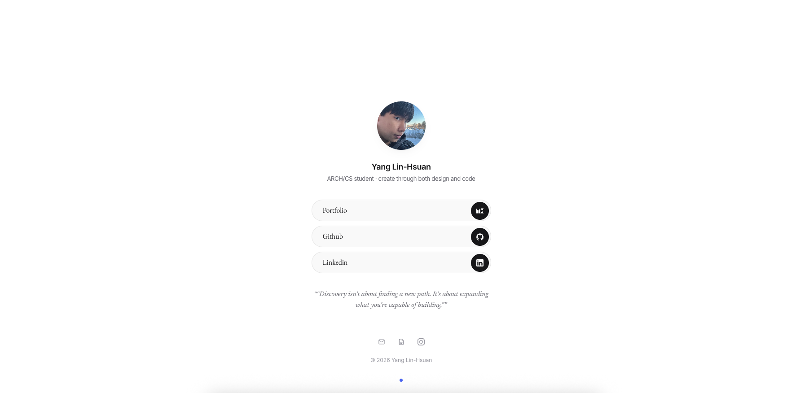

# Yang Lin Hsuan's LinkTree
---


Yang Lin-Hsuan's link hub. Two pages that gathers the portfolio, GitHub, LinkedIn and contact details behind a single URL — the one you paste where only one link fits, like an Instagram bio.

## Build with

- React & TypeScript
- Tailwind CSS v4 (@tailwindcss/vite)
- Gsap

>React + TypeScript + Tailwind v4 + Vite. GSAP drives the entrance animation, the avatar's hover ring, and the About reveal.

## Highlights
- **Interactive Link Buttons** — Built with 21st.dev components and smooth motion for a more responsive experience.
- **Simple Link Rows** — Uses an icon library instead of individual SVG files, keeping the code cleaner and easier to maintain.
- **Floating Avatar** — Uses `whileHover` to create a subtle floating motion when hovering over the photo.
- **Signature Animation & Falling Text** — Adds playful motion to make the introduction feel more personal and engaging.


## Development

```bash
git clone  git@github.com:ylx959/links.git
npm install
npm run dev      # http://localhost:5173
npm run build    # outputs to dist/
```


## Editing your own content

All you need to change lives in `src/data/` — unless you’re a developer and want to dig deeper.

| File | Holds |
|---|---|
| `profile.ts` | Name, one-line headline, avatar, quote |
| `links.ts` | `groups` — the main buttons; `footerLinks` — the small icons above the copyright |
| `site.ts` | Page title, description, canonical URL |
| `about.ts` | The paragraph on the scroll-down screen. Delete the `about` key in `site.ts` and the page goes back to one screen |

The `icon` field only accepts names registered in `src/icons/registry.tsx` (`github`, `linkedin`, `x`, `instagram`, `youtube`, `threads`, `discord`, `portfolio`, `mail`, `resume`, `link`). Typos fail the build instead of showing a blank icon. To add a platform, add its SVG to the registry — its key automatically becomes a valid option.

### Change the photo

Replace `public/avatar.webp`, or add another image to `public/` and update `avatar.src` in `src/data/profile.ts` (for example, `public/me.jpg` becomes `/me.jpg`). A square image works best. Adjust `zoom`, `offsetX`, and `offsetY` to crop it, update `alt`, and set `initials` as the fallback.

### Change the handwritten title and signature

Replace the SVG you want to change:

| File | Appears as |
|---|---|
| `src/assets/about-signature.svg` | The large handwritten “About me.” title |
| `src/assets/signature.svg` | Your personal signature shown at the end |

Export open stroked paths—not outlined or filled letters—and keep each pen stroke as a separate `<path>`. Path order controls the drawing order. If you change the title words, also update `heading` in `src/data/about.ts` for screen readers.

## About Animation
Scroll past the links to reach the **About** section, hinted by the small blue dot above.
### How It Works
- **Signature** — A handwritten SVG drawn stroke by stroke with GSAP `DrawSVGPlugin`.
- **Typewriter** — Paragraphs type character by character with a blue caret.
- **Falling Words** — Finished paragraphs split into words and fall with Matter.js physics: gravity, collisions, bounce, and fade.
- **Shared World** — All paragraphs share one physics world, so words pile on each other. The final paragraph stays on screen.
- **Timeline** — Runs for ~22 seconds and resets when you scroll away.
- **Accessibility** — Skipped under `prefers-reduced-motion`.
Physics is adapted from [React Bits](https://reactbits.dev) `FallingText`:
```bash
npx shadcn@latest add @react-bits/FallingText-TS-CSS
```

src/animation/wordPhysics.ts keeps its physics behavior while handing control to the main timeline.

## Rights
© 2026 YLX Studio. All rights reserved, read License before you use it.


